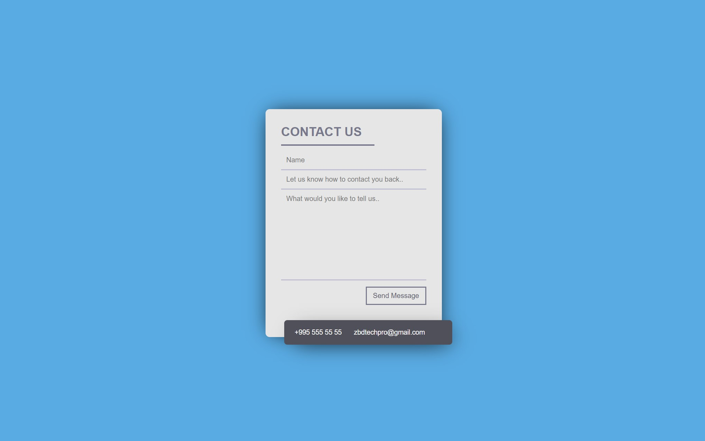

# Fully Functioning Contact Form in Django

## steps to install it:
    1. Install all requirements.txt

        pip install -r requirements.txt

    2. Move to settings.py and insert your own <password>
        NOTE: if you don't know what is the password is, contact me zbdtechpro@gmail.com

    3. Go on and check

